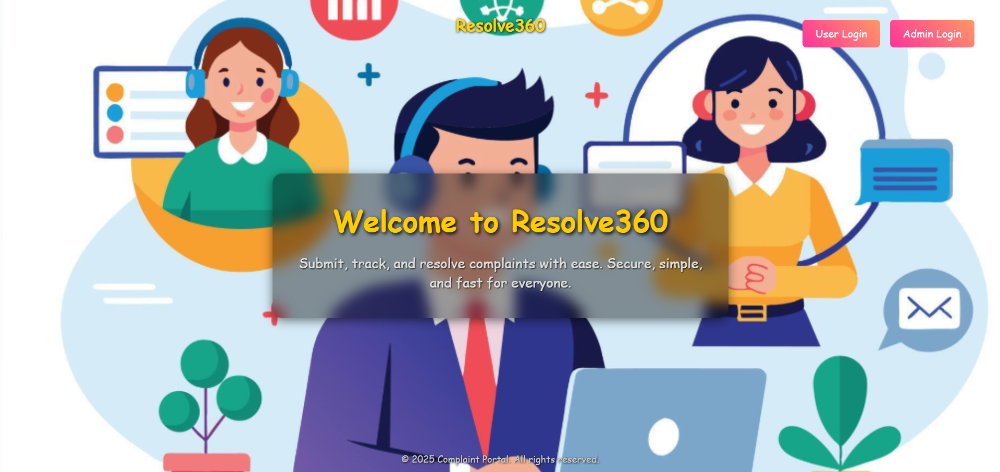
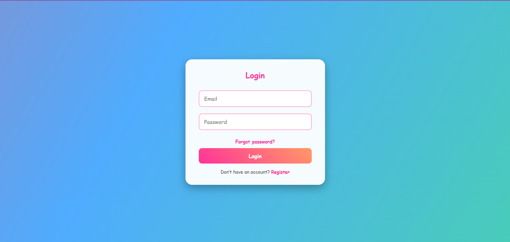
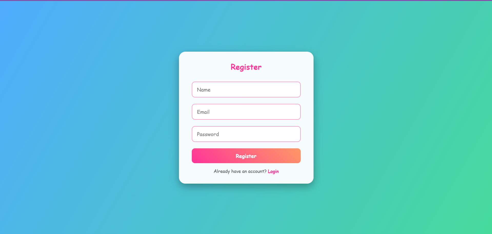
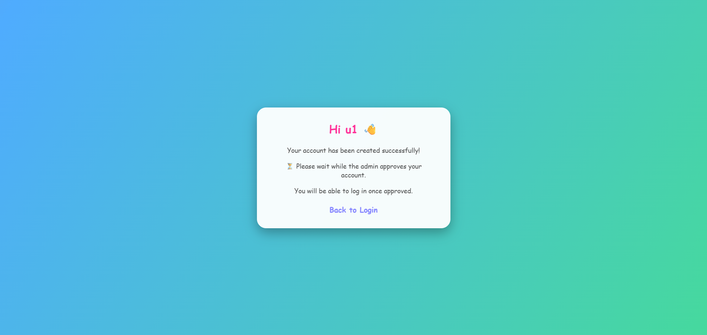
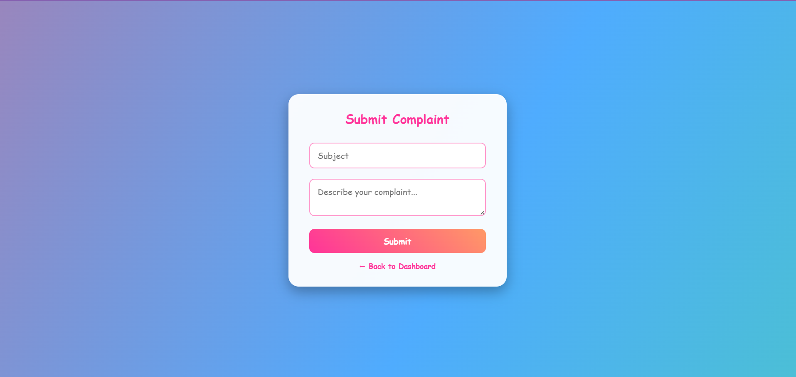
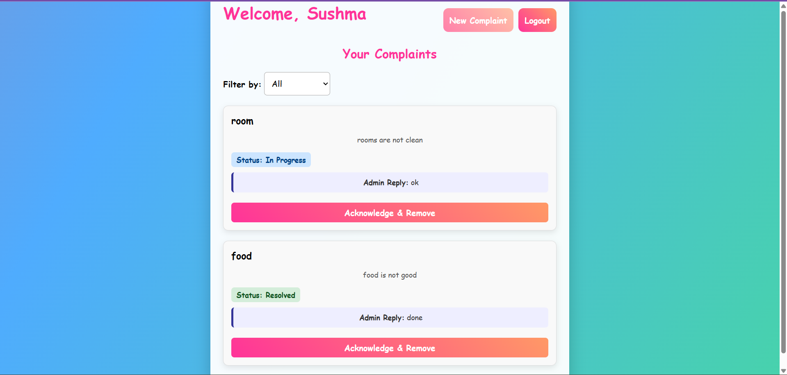
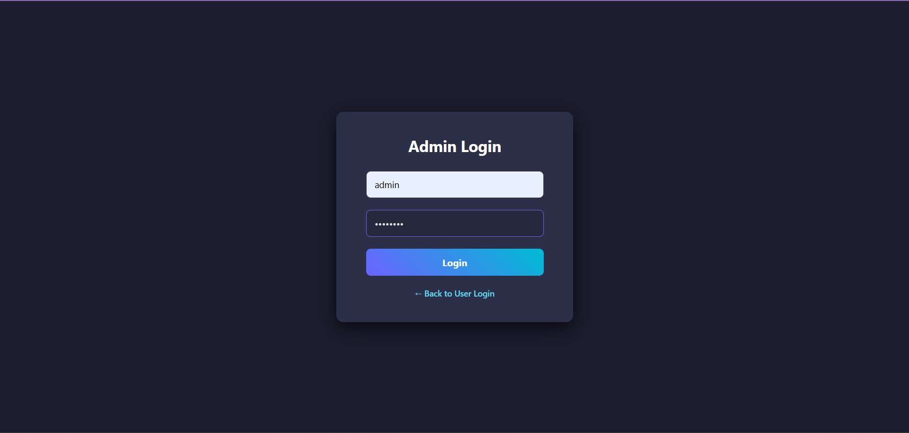
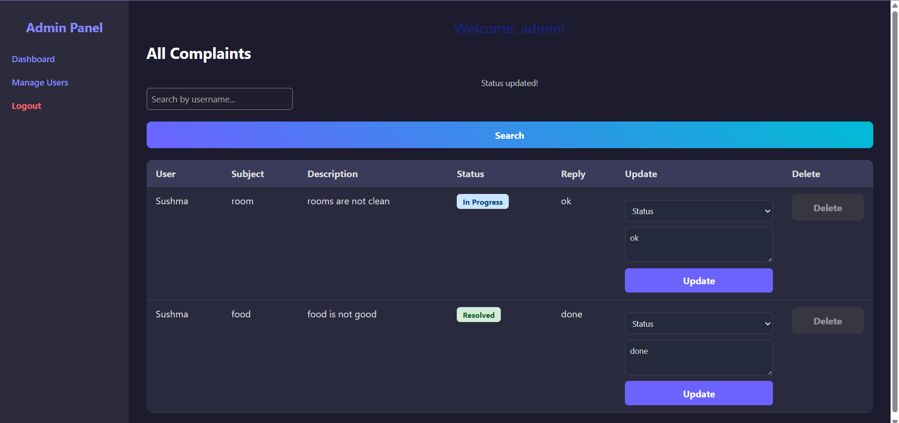
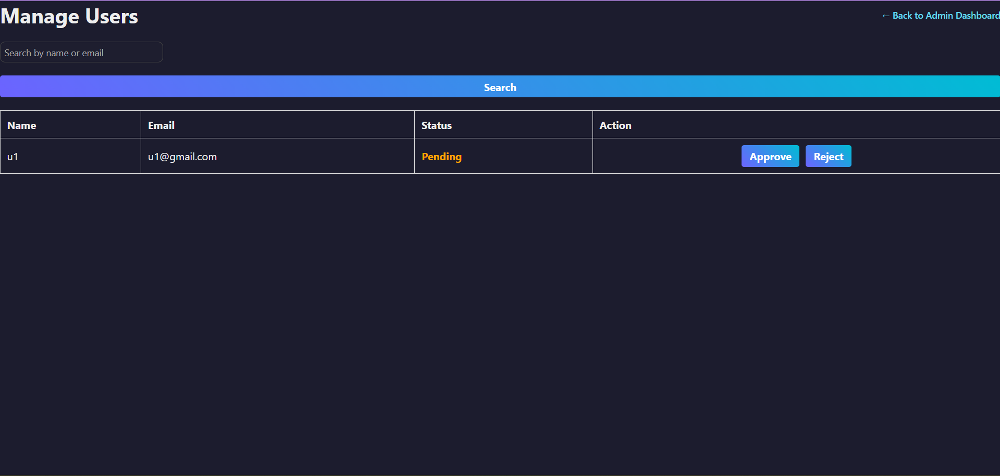

# Resolve360 🛠️

A **Complaint Management System** that allows users to **submit, track, and resolve complaints** efficiently.  
Built with **simplicity, security, and speed** in mind.

---
## 🚀 Features
✅ User-friendly landing page  
✅ Secure **user registration & login**  
✅ Complaint submission & tracking  
✅ Admin dashboard for management  
✅ Fast & responsive design  

---

## ⚙️ Tech Stack
- **Frontend:** HTML, CSS, EJS, JS
- **Backend:** Node.js, Express.js  
- **Database:** MySQL  
- **Version Control:** Git & GitHub  

---

## 📸 Screenshots

### 🏠 Landing Page

### 👩‍🎓 User Side
- **User Login**  
  

- **User Register**  
  
  
- **Waitlist**  
  

- **Submit Complaint**  
  

- **Complaints List**  
  

### 👨‍💼 Admin Side
- **Admin Login**  
  

- **Admin Dashboard**  
  

- **Manage Users**  
  

---

